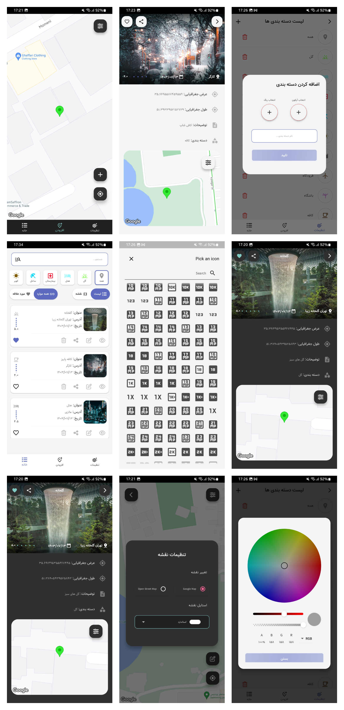
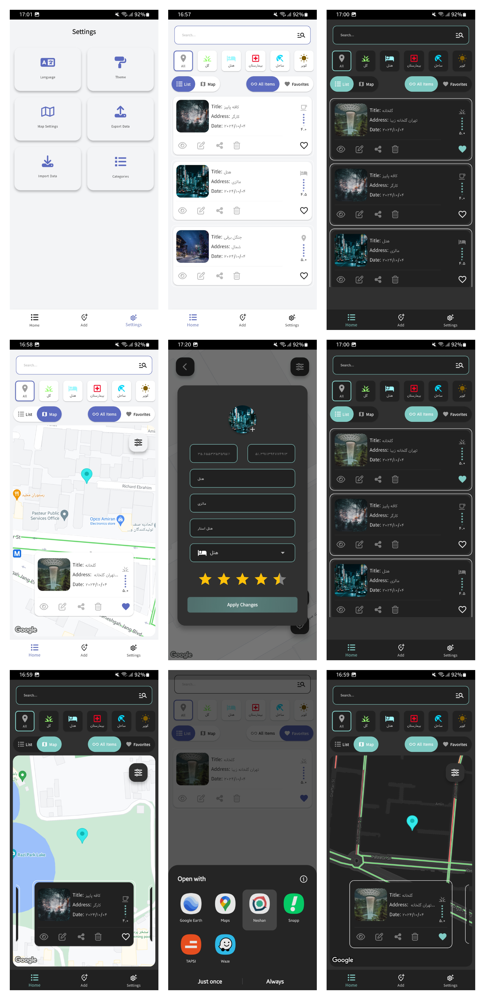

 

## 📍 Locate Me

**Locate Me** is a location tracking Flutter app designed for a seamless and personalized experience. It integrates modern tools and architecture to provide real-time location handling, powerful state management, and user-friendly features for organizing and sharing your places.

👉 [Get Locate Me on Myket](https://myket.ir/app/com.example.locate_me)

### ✨ Key Features

* 🗺️ **Real-Time Location Tracking**
  Uses **Google Maps** and **OpenStreetMap** for accurate and responsive location tracking.

* 📦 **Offline Data Storage**
  Stores saved locations locally using the **Drift** database, so your data is available even without internet access.

* 🔁 **Modern State Management**
  Built with **Riverpod** and **Flutter Hooks** for responsive UI and clean app architecture.

* 🧭 **Navigation & Routing**
  Uses **go\_router** to handle navigation and routing throughout the app.

* 🔐 **Authentication**

  * Integrated **Supabase** (in code) for scalable user authentication and management.
  * Supports **local authentication** with password and biometric options.

* 🗂️ **Location Categorization**
  Easily organize saved places by categories for quick access and better management.

* 🌍 **Multi-Language Support**
  Supports **English** and **Farsi (Persian)** for a localized user experience.

* 🎨 **UI Customization**

  * Switch between **light** and **dark** themes.
  * Apply **custom map styling** for a personalized look.

* ⚙️ **Settings Screen**
  Manage app preferences like language, theme, and security from a dedicated settings panel.

* 💾 **Backup & Restore**
  Backup your location data to your device and restore it when needed.

* 📤 **Location Sharing**
  Share saved places with friends or open them in other navigation apps.

